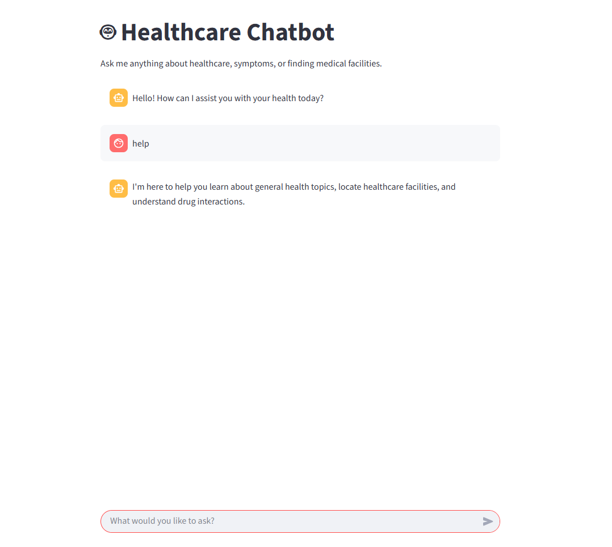

# NLP Healthcare Chatbot with Streamlit

A user-friendly, web-based chatbot built with Python, Streamlit, NLTK, and TensorFlow/Keras. This chatbot acts as a basic healthcare assistant, capable of understanding user queries and providing relevant information in a clean, interactive interface.


*(Note: You will need to upload your screenshot to a service like Imgur and replace the URL above.)*

## 🌟 Features

- **Modern Web Interface**: Built with Streamlit for a responsive and intuitive user experience.
- **Natural Language Understanding**: Uses NLTK for tokenization, lemmatization, and processing user input.
- **Intent Recognition**: A deep learning model built with TensorFlow/Keras classifies user intent.
- **Extensible Knowledge Base**: Easily add new skills and responses by editing the `intents.json` file.

---

## 🛠️ Technologies Used

- **Python**
- **Streamlit**: For the web application interface.
- **TensorFlow / Keras**: For building and training the neural network.
- **NLTK (Natural Language Toolkit)**: For all natural language processing tasks.
- **NumPy**: For numerical operations and handling training data.

---

## 🚀 Setup and Installation

Follow these steps to get the chatbot running on your local machine.

### 1. Prerequisites

- Python 3.8+
- Git

### 2. Clone the Repository

First, clone the repository to your local machine.

```bash
git clone [https://github.com/your-username/nlp-chatbot.git](https://github.com/your-username/nlp-chatbot.git)
cd nlp-chatbot
(Replace your-username and nlp-chatbot with your actual GitHub username and repository name.)3. Create a Virtual EnvironmentIt is highly recommended to use a virtual environment to manage project dependencies.# Create the virtual environment
python -m venv venv

# Activate it (Windows)
.\venv\Scripts\activate

# Activate it (macOS/Linux)
source venv/bin/activate
4. Install DependenciesInstall all the required packages using the requirements.txt file.pip install -r requirements.txt
5. Train the ModelBefore you can run the chatbot, you must first train the neural network. This will process the intents.json file and create a trained_model.keras file.python train.py
▶️ How to RunOnce the model is trained, start the Streamlit application with the following command:streamlit run app.py
A new tab will open in your browser with the chatbot interface.📂 Project Structure.
├── venv/
├── app.py              # The main Streamlit application file
├── intents.json        # The knowledge base for the chatbot
├── train.py            # Script to train the neural network model
├── requirements.txt    # Lists all project dependencies
├── .gitignore          # Specifies files for Git to ignore
└── README.md           # You are here!
